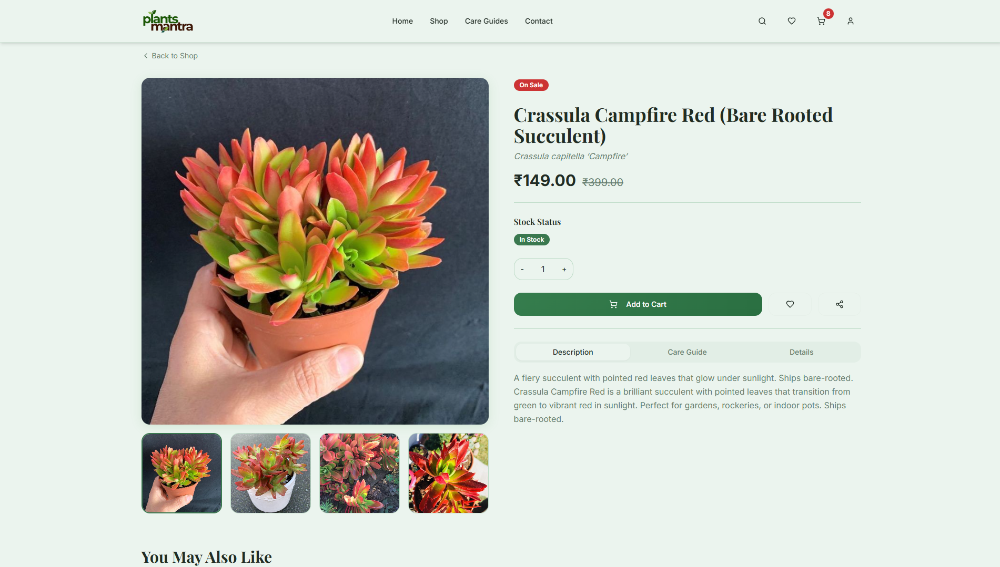
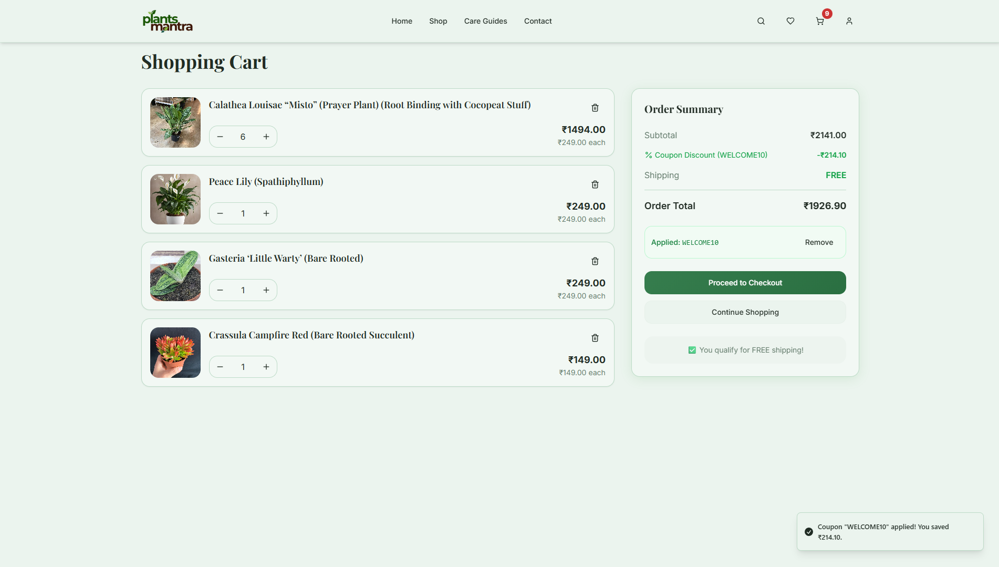
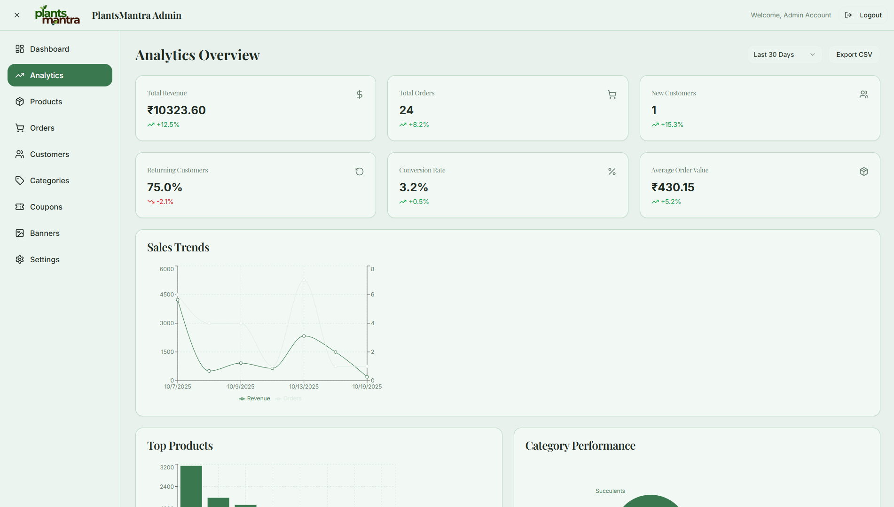

# 🌿 PlantsMantra E-commerce Platform

## 🏪 Overview
**PlantsMantra** is a modern, full-stack e-commerce platform developed for the client **Ajay Mehra**.  
It delivers a seamless shopping experience with robust product management and secure payment gateways.

The platform uses a **React + Vite (TypeScript)** frontend and a **Supabase** backend for authentication, database, real-time logic, storage, and Edge Functions.

---

## 🖼️ Preview Screenshots

<p align="center">
  <table>
    <tr>
      <td align="center" width="50%">
        
        <br>
        🏠 <b>Homepage</b>
      </td>
      <td align="center" width="50%">
        
        <br>
        🪴 <b>Product Details Page</b>
      </td>
    </tr>
    <tr>
      <td align="center" width="50%">
        
        <br>
        🛒 <b>Shopping Cart</b>
      </td>
      <td align="center" width="50%">
        
        <br>
        🧑‍💼 <b>Admin Dashboard</b>
      </td>
    </tr>
  </table>
</p>

---

## 🚀 Technical Stack

| **Category**         | **Technology**                          | **Notes**                                            |
|----------------------|-----------------------------------------|------------------------------------------------------|
| **Frontend**         | React / Vite (TypeScript)               | Fast builds and excellent DX                         |
| **UI / UX**          | Tailwind CSS, Shadcn UI                 | Utility-first styling + component library            |
| **State Management** | Zustand                                 | Persistent global state for Cart & Wishlist          |
| **Backend**          | Supabase                                | PostgreSQL, Auth, Storage, Edge Functions            |
| **Payments**         | Stripe, Razorpay                        | Secure processing via Supabase Edge Functions        |
| **Data Fetching**    | TanStack Query (React Query)            | Efficient server-state management                    |

---

## ✨ Key Developer Features

### 🧩 Full-Stack Supabase Implementation
- **RBAC & Admin Portal**
  - Custom `user_roles` system secures `/admin`.
  - Admin modules: Products, Categories, Coupons management.
- **Order & Customer Analytics**
- **Persistent Cart Logic**
  - `useCart` (Zustand) manages local cart state.
  - `CartSync` component reconciles/loads cart with the `cart_items` table in Supabase on auth changes.
- **Serverless Payment & Validation (Edge Functions)**
  - `validate-coupon` enforces rules (min purchase, max discount, date limits).
  - Payment handlers for **Stripe** and **Razorpay** (order creation & verification).

---

### 🛍️ E-commerce & Management
- **Comprehensive Product Schema**
  - Product variants, stock statuses (`in_stock`, `low_stock`), SEO fields.
- **Dynamic SEO**
  - `SEOTags.tsx` sets `<title>` and `<meta name="description">` from product data (important for SPA SEO).
- **Customer Features**
  - Account management, address forms, order history, wishlist.
- **🌱 Plant Finder Quiz**
  - `PlantFinder.tsx` recommends product categories based on user answers.

---

## 🛠️ Getting Started (Using NPM)

### ⚙️ Prerequisites
- Node.js **v18+**
- npm

### 📦 Installation
```bash
# Clone the repository
git clone [REPO_URL] neeraj704-plantsmantra
cd neeraj704-plantsmantra

# Install dependencies
npm install
```

### 🔐 Environment Setup
> ⚠️ The Supabase and API keys included in the repo are placeholders. For development and production, create and configure your own keys.

You must set the following environment variables (example names — adapt to your `.env` schema):

```env
# Supabase
VITE_SUPABASE_URL=https://your-supabase-project.supabase.co
VITE_SUPABASE_ANON_KEY=your-anon-key
SUPABASE_SERVICE_ROLE_KEY=your-service-role-key

# Stripe
STRIPE_SECRET_KEY=sk_live_...
STRIPE_WEBHOOK_SECRET=whsec_...

# Razorpay
RAZORPAY_KEY_ID=rzp_live_...
RAZORPAY_KEY_SECRET=...

# Other
NEXT_PUBLIC_APP_NAME=PlantsMantra
```

Also run the SQL migrations in `supabase/migrations/` against your Supabase project to provision tables, indexes, and RLS policies.

### 🧑‍💻 Running the Application
**Development Mode**
```bash
npm run dev
```
The app runs at `http://localhost:8080` (or port configured in your environment).

**Production Build**
```bash
npm run build
```
Generates optimized static assets for deployment.

---

## 📁 Project Structure (high level)
```
/src
  /components
  /pages / routes (or App Router)
  /lib (supabase client, utils)
  /stores (Zustand stores)
  /styles (tailwind config)
supabase/
  /migrations
  /functions (edge functions)
public/
```

---

## ✅ Notes & Recommendations
- Replace placeholder API keys before running or deploying.
- Test Edge Functions locally (Supabase CLI) before production.
- Use RLS and Supabase row-level policies to secure user data.
- Add logging & monitoring for payment Edge Functions (webhooks).
- Consider adding tests for critical flows (checkout, coupon validation).

---

## 💚 Author
Developed by **Neeraj Sharma** for **PlantsMantra**.  
Built with performance, security, and delightful UI in mind 🌿.
